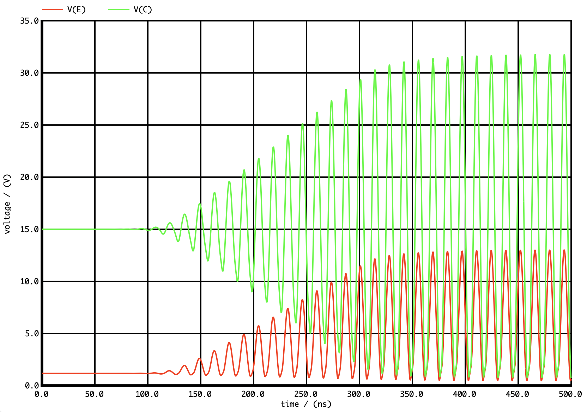

# Colpitts 

A SPICE netlist for the simulation of a Colpitts oscillator.
The Voltage amplification stage is made using a 2N2222 BJT transistor.

## Output oscillation

## Source

The author of the original article is [S.Dusausay](http://serge.dusausay.free.fr/ss/COLPITTS/colpitts.pdf)
